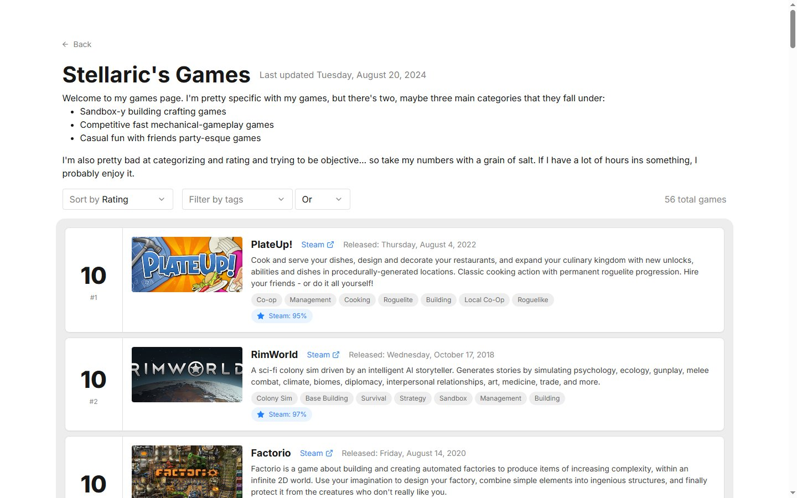

# games-list

A social platform for **rating video games on a 0–10 scale** and sharing your lists. Build a ranked list of everything you've played, add commentary, and browse other people's taste.

🔗 **Live:** [games.stlr.cx](https://games.stlr.cx)



## What it does

- **Personal rated lists** — score games 0–10 and annotate them with your own notes.
- **Browse & compare** — view other users' lists to see how their taste lines up with yours.
- **Rich game data** — titles, cover art, and metadata are pulled in through the `acquire/` ingestion pipeline rather than entered by hand.

## Repository layout

| Path | What's inside |
|------|---------------|
| `nextjs/` | The web app — Next.js frontend + API routes |
| `acquire/` | Data-acquisition scripts that gather and normalize game metadata/ratings |

## Tech stack

| | |
|---|---|
| Framework | Next.js (React) |
| UI | React-Bootstrap + Sass |
| Database | Postgres ([Neon serverless](https://neon.tech/)) |
| Storage | S3 (cover art / assets) |

## Running locally

```bash
cd nextjs
npm install
npm run dev        # http://localhost:3000
```

Requires a Postgres connection string (Neon) and S3 credentials — set them in `nextjs/.env.local` before running.
